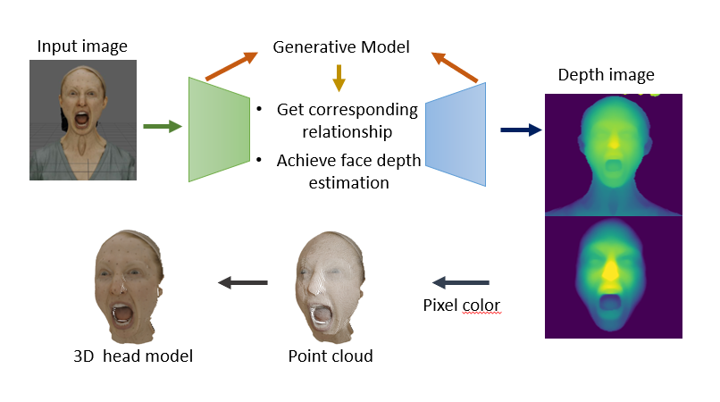
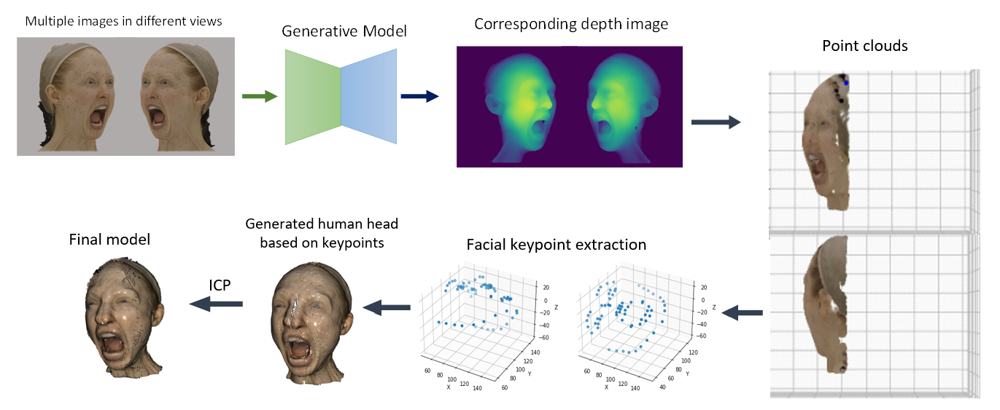

# 3D Human Head Reconstruction Based on Depth map
## Introduction 
3D human head reconstruction is a long-standing research topic in the field of computer graphics. It is generally divided into two approaches: single-view and multi-view reconstruction. In this project, we propose a novel method that achieves 3D human head reconstruction from both single-view and multi-view inputs based on depth map estimation. Additionally, we create our own dataset, which includes various human head depth images and their corresponding original images, in collaboration with VISUALSKIES.
## Dataset
In this project, we create a completely new dataset for human head depth image estimation, with data provided by VISUALSKIES. Utilizing high-quality 3D human head OBJ mesh models from VISUALSKIES, we use the Python API in Maya to extract depth information into TXT files for each head model across 19 different views. The depth information in these files includes the values of the X, Y coordinates and the distance to the camera plane for each point on the 3D model. With this depth information, we generate depth images by mapping the extracted X and Y values to pixels in a 2D image and using the distance value as the depth value. To address potential gaps in the depth map caused by uneven distribution of facets and varying point densities in each model, we subdivide the models to increase the number of points, ensuring more comprehensive depth map coverage. Additionally, we render corresponding original images to serve as ground truth. The final dataset includes 950 depth images, each with 180 x 180 pixels, paired with realistic images as ground truth. Moreover, the dataset features more than 20 different facial expressions to enhance generalization.
## Overview
### Single view
When using a single image as input, the method first conducts depth estimation using a neural network that utilizes Variational Autoencoders to train on our self-designed dataset. After obtaining the depth image, the method extracts each pixel from the depth image and employs the corresponding pixel color and depth information for mapping in 3D space, thereby generating 3D point clouds of the estimated human head. The entire pipeline of single image reconstruction is depicted below. 
### Multi-view
When inputting multiple images, this method utilizes the predicted depth images and point clouds from each image. It employs facial key points to align the point clouds from each image. Then, it applies the Iterative Closest Point (ICP) algorithm to minimize the differences between the point clouds. Finally, this enables the extraction of a combined multi-view 3D point cloud model of the human head. The entire pipeline of multiple images reconstruction is shown below. 
## Conslusion
In this project, we proposed a novel method for 3D human head reconstruction from images. For single-image input, the method performs depth estimation using a neural network based on Variational Autoencoder. Each pixel's color and depth information are then mapped into 3D space to generate point clouds. For multiple images, the method uses predicted depth images and point clouds. Facial key points align the point clouds, and the ICP algorithm minimizes differences between them, resulting in a combined multi-view 3D point cloud model of the human head.

Future work will focus on enhancing accuracy for extreme angles, increasing robustness for wild images, integrating advanced algorithms for improved depth estimation and alignment, enabling real-time processing, and expanding the dataset to improve generalizability. These enhancements aim to further optimize the method for diverse applications in 3D human head reconstruction.
